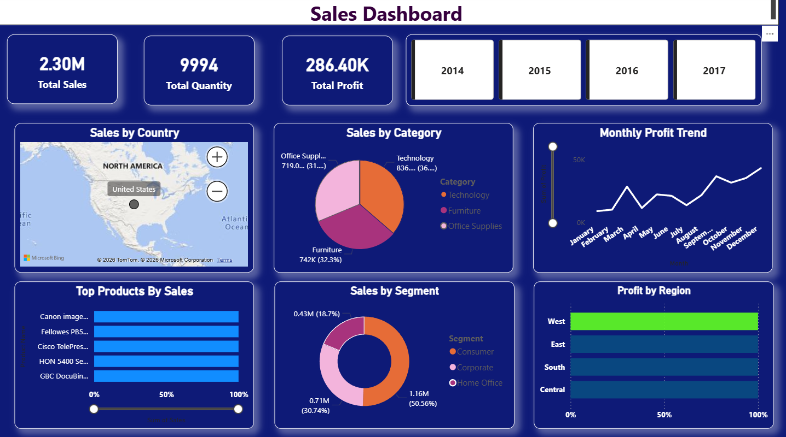

# sales-dashboard-powerbi

Sales Performance Dashboard using Power Bi
## Note
The dashboard design shown in the screenshot is a styled version of the same project for better visualization.
## Dashboard Preview

Problem Statement

Analyze sales data to identify trends across regions, categories, and time.

Key Insights

- Total Sales: 2.3M
- West region generates highest profit
- Technology is the top-performing category
- Profit increases towards year-end

Tools Used

- Power BI

Files Included

- Ecommerce_Sales_Dashboard.pbix
- dashboard.png
